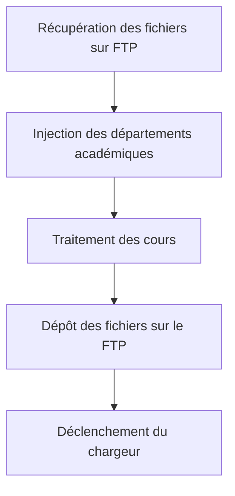

# Chargeur de cours Leganto

Dans Alma, les listes de lectures sont liées à des cours. Une liste de lecture peut être liées à 0 ou plusieurs cours. Le cour permet : 

- de rattacher la liste de lecture à un département de traitement,
- de déclarer les instructeurs responsables d’un cour
- de déclarer les étudiants inscrits au cour

Le cour est rattaché à un département de traitement et à un département académique. Le premier département permet aux opérateurs de filtrer les listes et références qui appartiennent à leur périmètre de gestion. Le département académique est exploité à des fins statistiques.

Les cours ont une date de début et de fin. De ces dates va dépendre la visibilité des listes de lecture et des fichiers associés. La liste de lecture ne sera visible que lors de période d’ouverture du cour.  

# Spécifications fonctionnelles

## Université de Bordeaux

L’université de Bordeaux possèdent plusieurs plateformes MOODLE

L’identifiant usagé utilisé par Moodle est l’EPPN

Les dates de début et de fin de cours ne sont pas toujours bien gérés par les enseignants :

- Des cours peuvent ne pas avoir de date de fin
- Certains cours peuvent avoir une date de fin périmée

D’une année sur l’autre, les cours ne sont pas fermés et reconduits. ILs sont simplement laissé ouverts sur la plateforme.

Les cours sont rattachés à des catégories, il peut y avoir plusieurs niveaux de catégories. Ces catégories ne sont pas liés à un référentiel externe.

# Spécifications techniques pour l’extraction et la fourniture des données de Moodle

Les cours sont chargés à partir d’un fichier csv via un chargeur Alma. Les données sont extraites de Moodle via une requête SQL réalisée par la cellule d’ingénierie pédagogique. Le fichier est déposé sur un serveur FTP du SCOOP.

Les cours sont rattachés à des départements académiques dans Alma. Cette table est alimentée à partir de la liste des catégories déclarées dans Moodle. Pour ne pas que le chargeur rejette le cour concerné il est nécessaire de charger la liste des catégories avant de charger les cours. Cette liste des catégories est aussi fournie par la cellule d’ingénierie pédagogique



## Liste des catégories

### **Périmètre des données :**

Toutes les catégories actives sur la plateforme

### **Données attendues :**

| Id | Identifiant de la catégorie |
| --- | --- |
| name | Nom de la catégorie |
| fullname  | Nom de la catégorie est des catégories parentes |
| path | Identifiant de la catégorie et des catégories parentes |
| N1 | Identifiant de la catégorie parente de premier niveau |
| N2 | Identifiant de la catégorie parente de deuxième niveau |

### **Fréquence de fourniture des données**

Dés qu’une catégorie est créée, modifiée ou supprimée, la totalité de la liste  est renvoyée

### **Format et Règles de nommage du fichier**

Fichier tabulé avec des tabulations comme séparateur.

[Identifiant établissement]_[Code plateforme]_Categories_AAAA-MM-JJ.csv

Identifiant établissement et code plateforme sont fournis par le service de coopération.

## Liste des cours

### **Périmètre des données :**

Toutes les cours actifs sur la plateforme

### **Données attendues :**

| platform | Code de la plateforme Moodle |  |
| --- | --- | --- |
| CourseId | Identifiant Moodle du cours (id fourni par LTI à Alma) |  |
| CourseFullName | Intitulé complet du cour |  |
| CourseShortName | Intitulé court  |  |
| CourseStart | Date de début du cour | timestamp |
| CourseEnd | date de fin du cour | timestamp |
| LastCourseSettingsUpdate |  | timestamp |
| CategoryId | Identifiant de la catégorie du cour |  |
| Level1CategoryId | Identifiant de la catégorie parente de premier niveau |  |
| Level2CategoryId | Identifiant de la catégorie parente de deuxième niveau |  |
| TeachersList | eppn ou uid des formateurs associés au cour |  |
| StudentsCount | nombre d’étudiants inscrits |  |

### **Fréquence de fourniture des données**

La date de modification d’un cours n’est pas mise à jour lorsqu’un nouvel enseignant lui est assicié. Il est ainsi nécessaire de récupérer chaque jour la totalité de la liste

Chaque jour la totalité de la liste  est renvoyée

### **Format et Règles de nommage du fichier**

Fichier tabulé avec des tabulations comme séparateur.

[Identifiant établissement]_[Code plateforme]_Cours_AAAA-MM-JJ.csv

Identifiant établissement et code plateforme sont fournis par le service de coopération.

# Spécifications techniques du programme de traitement des données en provenance de Moodle

Le programme est un script écrit en Python stocké et exécuté sur le serveur du SCOOP. Il va traiter en une passe la totalité des fichiers quelque soit l’institution et la plateforme d’origine.

## Récupération des fichiers (modules/transferts_ftp.py)

Le programme récupère tous les fichiers présent dans le répertoire de dépôt et les copie dans un répertoire temporaire. Une fois le traitement effectué, le répertoire de dépôt est vidé et les fichiers ont archivés.

## Traitements de catégories de cours (modules/traitement_dept_univ.py)

Le programme formate les données en json et les passe en paramètre à l’API Alma [Update Code-table](https://developers.exlibrisgroup.com/alma/apis/docs/conf/UFVUIC9hbG1hd3MvdjEvY29uZi9jb2RlLXRhYmxlcy97Y29kZVRhYmxlTmFtZX0=) pour injecter les données dans la table **CourseFaculties**. Le traitement écrase toutes les données de la table pour les recréer.

### Mapping des données

| Id moodle | Description Moodle | Index colonne | Champ Alma | Traitement |
| --- | --- | --- | --- | --- |
| Id | Identifiant de la catégorie | 0 | Code | Préfixé par le code plateforme |
| name | Nom de la catégorie | 1 |  |  |
| fullname  | Nom de la catégorie est des catégories parentes | 2 | Description |  |
| path | Identifiant de la catégorie et des catégories parentes | 3 |  |  |
| N1 | Identifiant de la catégorie parente de premier niveau | 4 |  | Pour filtrage des données |
| N2 | Identifiant de la catégorie parente de deuxième niveau | 5 |  | Pour filtrage des données |

## Traitement des cours  (modules/traitement_cours.py)

### Mapping des données

[Liste et ordre des champs ](https://www.notion.so/039070137805469999f72cbd51d3bfe3)

### Filtrage des données

Dans le cas où l’établissement ne souhaite pas traiter des liste de lecture sur tous les cours de la plateforme, il est possible de filtrer ces derniers et les catégories correspondantes en fonction de la catégorie parente de premier Niveau et de la catégorie parente de second niveau.

Le filtre est déclaré via le dictionnaire **REGLES_FILTRAGE_SUR_DEPT.**  Il exclu les cours ou catégories qui n’appartiennent pas aux catégories listées dans **NIV_1** et exclus ceux qui appartiennent aux catégories listées dans **NIV_2** .

### Traitement des dates de fin

Les dates de début et de fin de cours ne sont pas toujours bien gérés par les enseignants :

- Des cours peuvent ne pas avoir de date de fin
- Certains cours peuvent avoir une date de fin périmée

Le chargeur rejette le cour si la date de fin n’est pas renseignée. Il est donc nécessaire d’appliquer une date de fin par défaut lorsque la date n’est pas renseignée. La date par défaut sera toujours le premier août de la fin d’année universitaire.

 

```python
def date_de_fin_de_cour() :
    month = datetime.now().month
    year = datetime.now().year
    # entre janvier et août l'année de fin est égale à l'année en cour
    if month >= 1 and month < 8:
        return date(int(year),8,1).strftime("%d-%m-%Y")
    # Entre août et décembre l'année de fin est égale à l'anée suivante
    else :
        return date(int(year)+1, 8, 1).strftime("%d-%m-%Y")
```

### Traitement des enseignants

Pour les établissements qui gèrent l’identification via l’EPPN, on filtre les enseignants dont le nom de domaine n’est pas celui d’un établissement du réseau.

Pour les établissements qui gèrent  l’identification via l’uid. On suffixe le champ par le nom de domaine de l’établissement.

```python
def traitement_des_enseignants(enseignants,institution):
    enseignants_list = enseignants.split(',')
    if CONF_INSTITUTIONS[institution]['type_identifiant'] == 'eppn' :
        #Si on nous envoie des eppns, on exclu tous les individus non membres de la communauté universitaire
        for enseignant in enseignants_list :
            domain = re.findall('^(.*?)@(.*?)$', enseignant)
            if domain[0][1] not in DOMAIN_LIST :
                enseignants_list.remove(enseignant)
    else :
        # Si ce sont des uid on les suffixe par le non de domaine de l'institution
        for i in range(len(enseignant)):
            enseignants_list[i] = "{}@{}".format(enseignant,CONF_INSTITUTIONS[institution]['domain'])
    return ",".join(enseignants_list)
```

# Documentation

[Configuring Course Loading](https://knowledge.exlibrisgroup.com/Alma/Product_Documentation/010Alma_Online_Help_(English)/090Integrations_with_External_Systems/040Fulfillment/010Courses_and_Reading_Lists/Configuring_Course_Loading)

[Basecamp Log In](https://3.basecamp.com/3765443/buckets/23884064/vaults/4254371660)